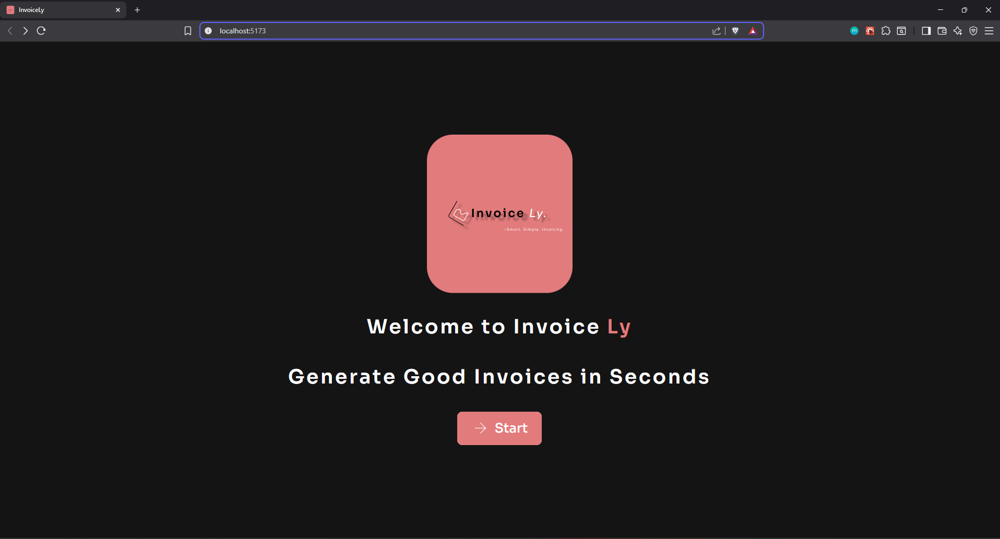

# Invoicely – Freelance Invoice Generator

<div align="center">

</div>
A simple web app to generate freelance invoices with support for form inputs, itemized billing, auto-calculation, and PDF export. Built using modern web technologies.

---

## 🛠 Tech Stack

- **React** – UI library
- **Vite** – Frontend tooling
- **Tailwind CSS** – Utility-first styling
- **HeadlessUI** – UI components
- **React Router** – Routing
- **react-hot-toast** – Notifications
- **jsPDF / html2canvas** (planned) – PDF export

---

## ScreenShot

<div >

</div>


## 📦 Installation

```bash
git clone https://github.com/VedantKulkarni05/invoicely.git
cd invoicely
npm install
npm run dev
```
